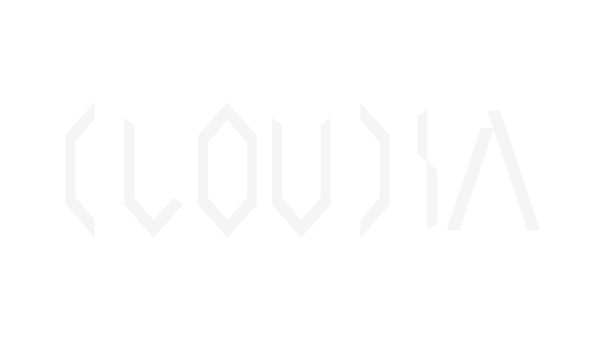

# 关于我

- 🏛️大学生（财务管理）
- ❤️信息技术爱好者
- 🚷没有干IT的命

# 未来计划

- 学习前端开发
- ~~呃好像没别的了（~~

# 现在会的

<!--
**CloudiaYunna/CloudiaYunna** is a ✨ _special_ ✨ repository because its `README.md` (this file) appears on your GitHub profile.

Here are some ideas to get you started:

- 🔭 I’m currently working on ...
- 🌱 I’m currently learning ...
- 👯 I’m looking to collaborate on ...
- 🤔 I’m looking for help with ...
- 💬 Ask me about ...
- 📫 How to reach me: ...
- 😄 Pronouns: ...
- ⚡ Fun fact: ...
-->
